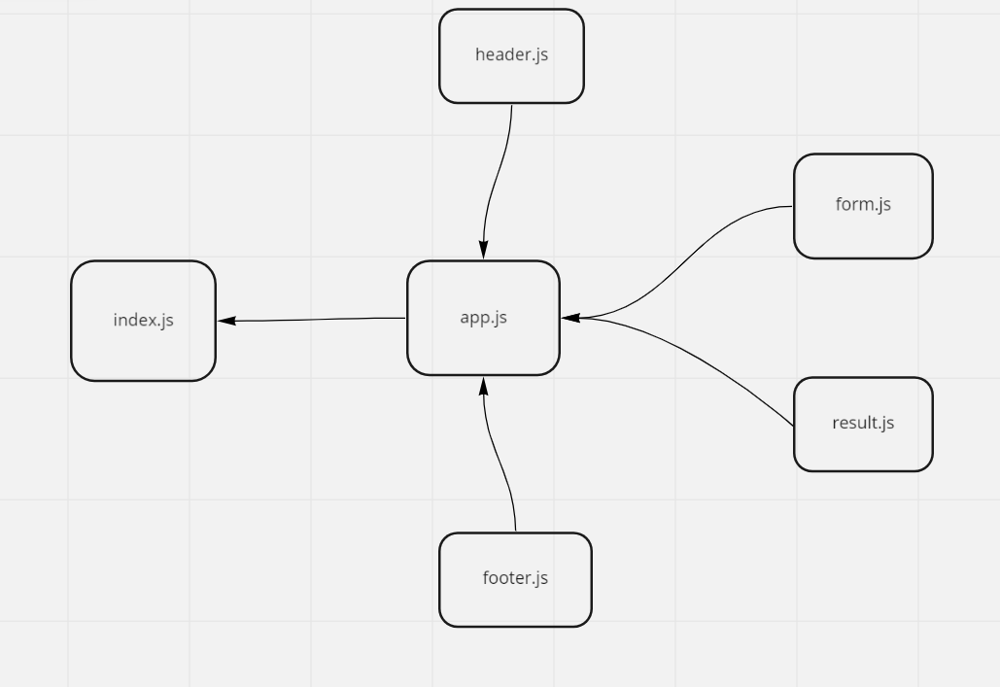

# RESTy

A browser based API testing tool

## Business Requirements

Our application will be an API testing tool that can be run in any browser, allowing a user to easily interact with APIs in a familiar interface.

## uml 

netlify deployment link : https://astonishing-crostata-17ec6f.netlify.app/